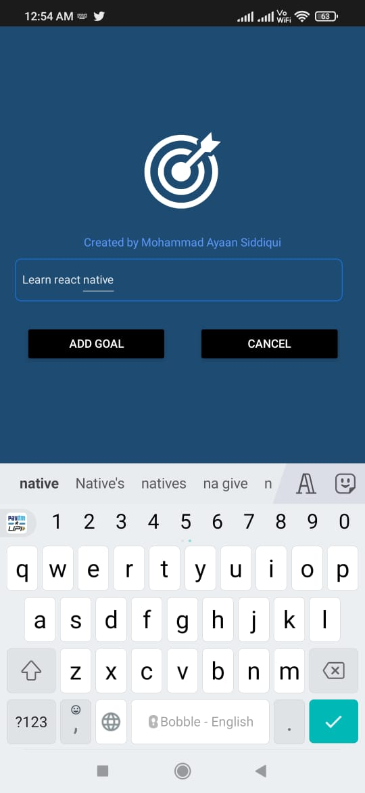
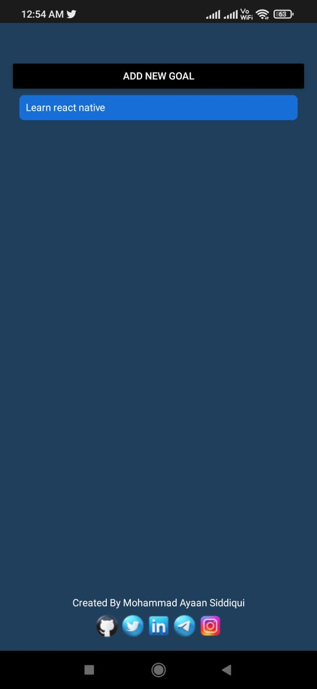

# React-Native-Goals.apk

**Download APK:- https://link.storjshare.io/junoihacbhe563pwgrc3d6bzzblq/react-native%2Frngoals.apk**

## About the Project

 
Goals app is an extremely BASIC and beginner level mobile app created using React Native. You can write your GOALS in the app. This is a cross-platform app as it runs on both ios and android (the deployment link belongs to apk).
**This is my PILOT PROJECT, my FIRST mobile-app.**

---

**INSTRUCTIONS**

- Click on ADD NOTE to open the add note page.
- Press on any note to DELETE it.
- You can't enter empty Note.

---

## Tech Stack

The app has been created using just REACT NATIVE. This doesn't have any backend integration yet but will have in future.

## Run on your mobile

- Download the apk from link
- Install the apk in your android device

## Future Updates

- Improved UI
- Backend Integration
- Authentication
  (More

> More updates will come as I learn more React Native concepts.

## About the Developer

Hello Everyone, My name is Mohammad Ayaan Siddiqui. I am a WEB3 developer and a FIRM BELIEVER of DECENTRALIZED WEB and cryptocurrencies in general. If you want to connect with me, the socials are below.

1.  Github- [https://github.com/moayaan1911](https://github.com/moayaan1911)
2.  Linkedin- "[https://www.linkedin.com/in/mohammad-ayaan-siddiqui-678564214/]
3.  Twitter- [https://www.twitter.com/usdisshitcoin](https://www.twitter.com/usdisshitcoin)
4.  Instagram- [https://www.instagram.com/moayaan_1911](https://www.instagram.com/moayaan_1911)
5.  Telegram-https://t.me/usdisshitcoin
